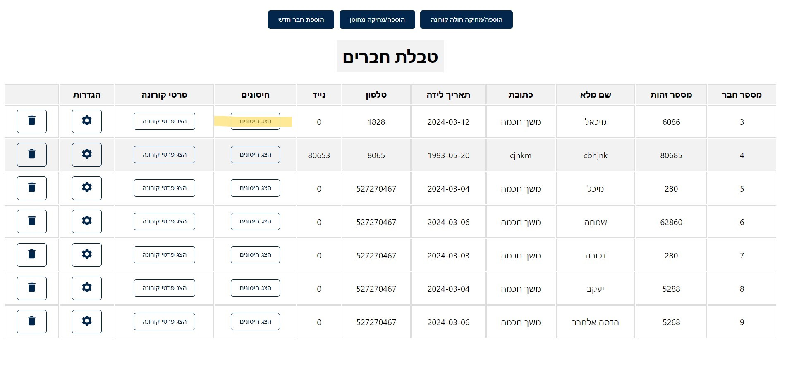
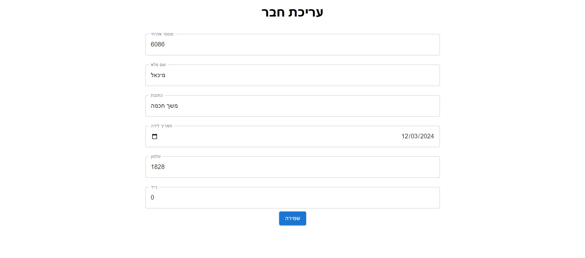
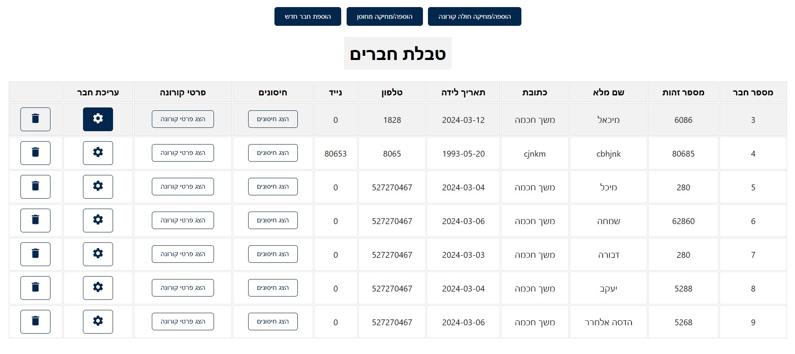
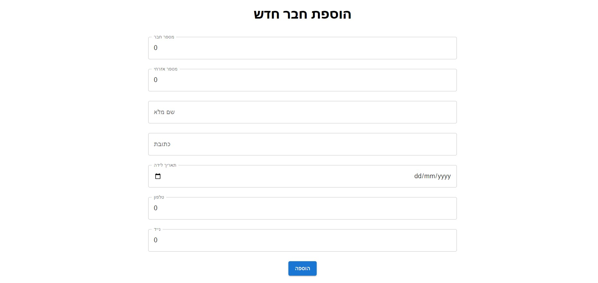
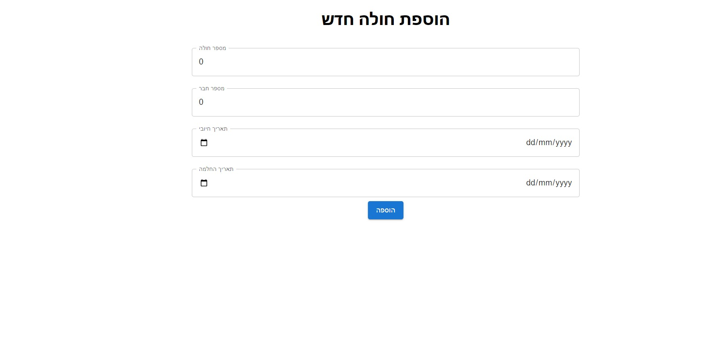

## HMO Management System

This project is a web-based application designed to manage the operations of a Health Maintenance Organization (HMO).
The system provides a comprehensive platform for managing HMO members, their medical records, vaccinations, and COVID-19-related information.

Start the server

```bash
  npm run start
```

## Project Structure

The project consists of two main parts:

1. Web API in C# with Visual Studio: This part serves as the server providing the services
   responsible for managing the HMO. Through the API, actions such as creating, updating, and
   deleting members, managing vaccination and patient details, and more can be performed.
2. Client-side in React with Visual Studio Code: This part serves as the visual user interface of the
   system. Through it, users can access the services provided by the API, perform actions such as
   viewing and managing members, vaccination details, patient details, and more.
   
## Workflow
The project was developed individually as part of my efforts to demonstrate my skills in full-stack 
development. I utilized Visual Studio and Visual Studio Code for efficient development and
collaboration.

## Installation and Running
1. Instructions for installing the Web API (Server):
   * Open the project in Visual Studio.
   * Configure the project's settings and run it.
   * Verify that the API is running properly and provides an endpoint for the client-side.
2. Instructions for installing the Client-side (Client):
   * Open the project in Visual Studio Code.
   * Install all necessary dependencies using npm or yarn.
   * Configure the project's settings and run it.
   * Verify that the UI is properly connected to the API and utilizes its services correctly.

## Key Technologies
* C#
* ASP.NET Core Web API
* React
* HTML
* CSS
* JavaScript


## Screenshots







## Run Locally

Clone the project
```bash
 git clone https://github.com/HadasaElharar/HadasimProject.git

```
Go to the project directory
```bash
  cd HadasimProject
```
 Install dependencies
```bash
 npm install
```
 
